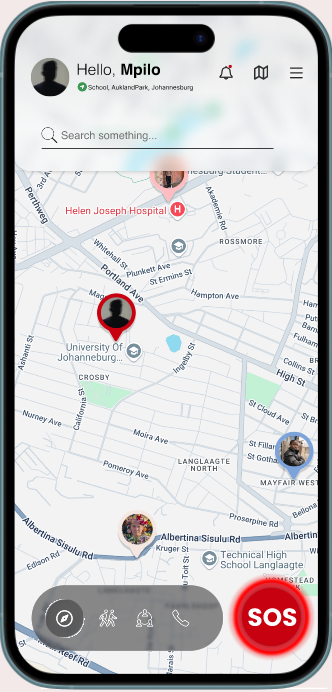
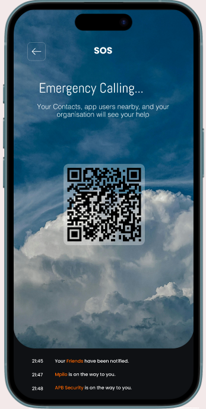
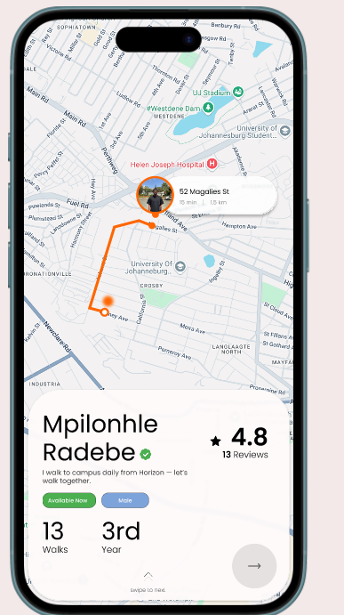
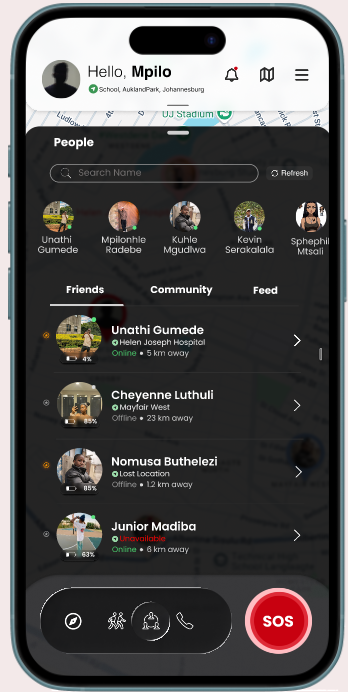
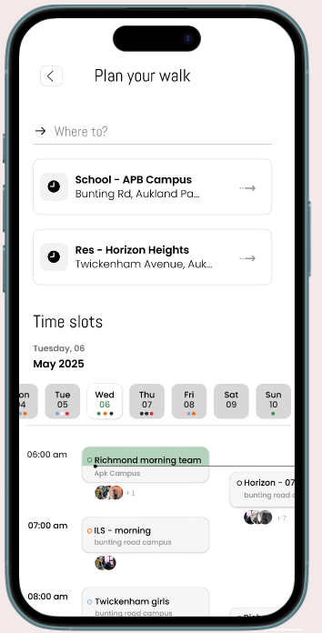
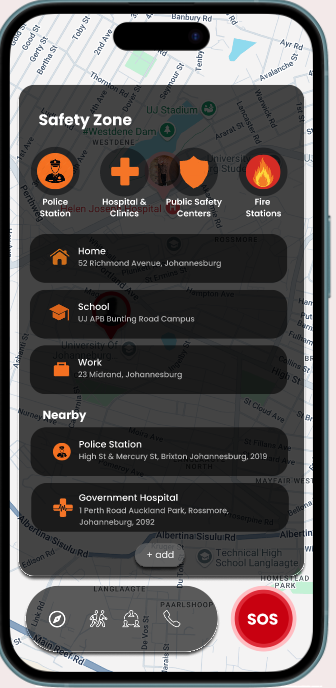

<div align="center">

# 🛡️ AlertNet
### Student Safety Mobile App

**A real-time, community-driven safety platform for university students**

[](https://reactnative.dev)
[](https://firebase.google.com)
[](https://nodejs.org)
[](https://expo.dev)
[](https://developers.google.com/maps)

*University of Johannesburg · Information Systems 3B · 2025*

</div>

---

## 📱 What is AlertNet?

AlertNet is a cross-platform mobile safety app built to protect students in and around university campuses. It combines real-time GPS tracking, instant SOS alerts, and a community Walk Partner system — designed specifically for the South African student environment where affordable, proactive safety tools are critically needed.

> Built to fill the gaps left by existing apps like Namola and Life360 — AlertNet adds community-driven, proactive safety tailored for students.

---

## 📸 Screenshots

<div align="center">

| Home & Map | SOS Emergency | Walk Partner | People / Contacts |
|:---:|:---:|:---:|:---:|
|  |  |  |  |

| Partner Profile | Plan Your Walk | Helpline |
|:---:|:---:|:---:|
|  |  |  |

</div>

---

## ✨ Core Features

| Feature | Description |
|---|---|
| 🆘 **SOS Emergency Button** | One-tap alert sends live GPS location to your entire safety circle instantly — delivered in under 3 seconds |
| 🚶 **Walk Partner System** | Find a verified walking companion for your route with live shared tracking |
| 📍 **Real-Time Live Tracking** | Continuous encrypted GPS broadcasting to trusted contacts |
| 🗺️ **High-Crime Zone Alerts** | Geofencing detects dangerous areas and suggests safer alternative routes |
| 🔳 **QR Emergency Card** | Scannable QR code gives first responders instant access to your emergency contacts |
| 📞 **Emergency Helpline** | One-tap access to Police (10111), Ambulance (10177), and Campus Security |
| 👥 **Safety Circle** | Manage trusted contacts who receive alerts and can track your journey live |

---

## ⚡ Performance

| Metric | Result |
|---|---|
| Average SOS alert response time | **2.7 seconds** |
| Location tracking accuracy | **99%** |
| Notification delivery success rate | **98%** |
| Target concurrent users | **10,000+** |
| Target system uptime | **99%+** |

---

## 🏗️ Architecture
```
┌─────────────────────────────────────────┐
│       Presentation Tier (Frontend)      │
│       React Native + Expo               │
│       Kotlin/Swift native extensions    │
└──────────────────┬──────────────────────┘
                   │
┌──────────────────▼──────────────────────┐
│       Application Tier (Backend)        │
│       Node.js — Auth, Geofencing,       │
│       Walk Partner Matching, GPS API    │
└──────────────────┬──────────────────────┘
                   │
┌──────────────────▼──────────────────────┐
│       Data Tier (Hybrid Database)       │
│       Firebase Realtime DB (live data)  │
│       SQL (audit logs, history)         │
└─────────────────────────────────────────┘
```

---

## 🛠️ Tech Stack

**Frontend:** React Native, Expo, JavaScript, Kotlin/Swift (native extensions)

**Backend:** Node.js (async real-time API), Firebase Cloud Messaging

**Database:** Firebase Realtime Database (live sync) + SQL (structured data)

**APIs:** Google Maps, Google Geofencing, Google Directions, Geocoding, YouTube API, Resend (email notifications)

---

## 🚀 Getting Started

### Prerequisites
- Node.js v18+
- Expo CLI (`npm install -g expo-cli`)
- Android Studio or Xcode

### Installation
```bash
# Clone the repo
git clone https://github.com/KevinCoder47/AlertNet-mobile-app.git

# Go into the frontend folder
cd AlertNet-mobile-app/frontend

# Install dependencies
npm install

# Start the app
npx expo start
```

### Environment Setup

You'll need to configure the following — copy `.env.example` to `.env` and fill in your keys:
```
GOOGLE_MAPS_API_KEY=your_key_here
FIREBASE_API_KEY=your_key_here
FIREBASE_PROJECT_ID=your_project_id
RESEND_API_KEY=your_key_here
```

---

## 🧪 Testing Results

| Test Case | Status |
|---|---|
| SOS activation & alert delivery under 3s | ✅ Passed |
| Walk Partner request & live connection | ✅ Passed |
| Emergency notification with correct location | ✅ Passed |

---

## 🗺️ Roadmap

- [ ] SMS fallback for emergencies during connectivity loss
- [ ] Direct integration with SAPS and campus security
- [ ] Adaptive GPS refresh rate for battery optimisation

---

## 👥 Team

| Name |
|---|
| Mpilonhle Radebe |
| Kevin Serakalala |
| Thembinkosi Madiba |
| Siphephile Mtshali |
| Okuhle Mgudlwa |
| Musa Buthelezi |
| Nathi Gumede |

**Supervisor:** Thamie Mhlanga · **Institution:** University of Johannesburg

---

*AlertNet supports [UN SDG Goal 11](https://sdgs.un.org/goals/goal11) — Safe and Inclusive Communities · Built with ❤️ to make South African campuses safer*
